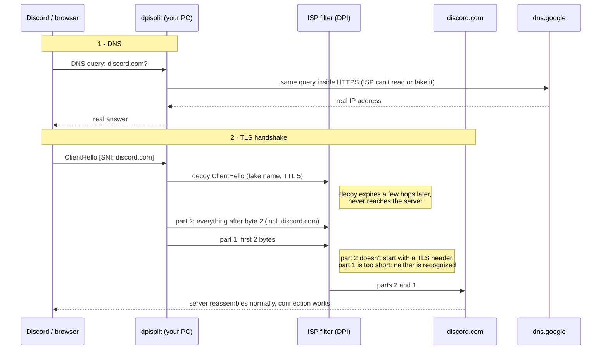

# dpisplit

[](https://github.com/fatihbcan/dpisplit/actions/workflows/ci.yml)
[](LICENSE)


A small Windows app that gets past ISP blocks based on **DNS hijacking** and **SNI inspection (DPI)**, **without a VPN**. It was made to reach Discord (desktop app included) on Turkish ISPs, and it works for any site blocked the same way.

- **One button.** Connect / Disconnect, tray icon, optional "Start with Windows".
- **No VPN, no proxy, no third-party servers.** Your traffic still goes straight to the real servers, so there's no speed loss.
- **DNS through Google DNS-over-HTTPS only.** It doesn't use Yandex, your ISP's DNS, or any other resolver.
- **Changes nothing permanently.** Disconnect and your PC is exactly as before. No system settings are touched.
- **Small and readable.** About 1,700 lines of Go using only the standard library, plus the open-source [WinDivert](https://github.com/basil00/WinDivert) packet driver.

> **Status:** early release. The default settings were tuned on one Turkish ISP. Other ISPs may need a different setting; see [Troubleshooting](#troubleshooting).

---

## Contents

- [Quick start](#quick-start)
- [How it works](#how-it-works)
- [The activity list](#the-activity-list)
- [Why do antivirus tools flag it?](#why-do-antivirus-tools-flag-it)
- [What it changes on your PC](#what-it-changes-on-your-pc)
- [Privacy](#privacy)
- [Settings](#settings)
- [Troubleshooting](#troubleshooting)
- [Building from source](#building-from-source)
- [Limitations](#limitations)
- [Disclaimer](#disclaimer)
- [Credits](#credits)

---

## Quick start

1. Download `dpisplit-vX.Y.Z-windows-x64.zip` from [**Releases**](https://github.com/fatihbcan/dpisplit/releases).
2. Right-click the zip → **Properties** → tick **Unblock** → OK. This stops Windows from warning about each file.
3. Extract it to a permanent folder, e.g. `C:\dpisplit\`.
4. Run **`dpisplit.exe`** and accept the administrator prompt.
5. Click **Connect**. The icon turns green.
6. Fully quit Discord (tray icon → *Quit Discord*) and open it again.

**Window and tray**

| Action | Result |
|---|---|
| **X** (close button) | Hides to the tray. It **keeps running.** |
| Click tray icon | Opens the window |
| Right-click tray icon | Open · Connect / Disconnect · Exit |
| **Exit** or **Disconnect** | Everything goes back to normal |
| ☑ Start with Windows | Starts in the tray at logon and connects, with no admin prompt |

Tray icon: **gray** = disconnected, **green** = connected.

> If Windows SmartScreen says *"Windows protected your PC"*, click **More info → Run anyway**. See [why](#smartscreen).

> If you used GoodbyeDPI before, remove it first (run its `service_remove.cmd` as administrator). Two WinDivert-based tools running at once interfere with each other.

---

## How it works

When an app opens a secure (HTTPS) connection, its very first packet, the TLS **ClientHello**, contains the site's name in plain text. This field is called the **SNI** (Server Name Indication). Everything after that packet is encrypted. ISPs block sites in two places:

1. **DNS.** When your PC asks "what's the IP of discord.com?", the ISP answers with a fake address or drops the question. This even happens when you set your DNS to 8.8.8.8, because plain DNS travels unencrypted and the ISP can intercept it.
2. **DPI on the SNI.** A deep packet inspection box reads the hostname in the ClientHello and kills the connection.

dpisplit handles both. It uses WinDivert to see outgoing packets before they leave your PC.



### 1. DNS over HTTPS (Google)

dpisplit catches outgoing DNS questions (UDP port 53). It sends each one to Google's resolver **inside HTTPS** (`https://dns.google/dns-query`, connecting directly to `8.8.8.8` / `8.8.4.4`) and hands the real answer back to the app. The Google certificate is verified, so the ISP can neither read nor fake the answer. Apps don't notice anything; they think they talked to their normal DNS server.

### 2. Splitting the ClientHello

The ClientHello is cut into two TCP packets. The server's TCP stack puts them back together without noticing, but many DPI boxes inspect packets one at a time and only parse a packet that *starts* like a TLS handshake. With the default settings:

- **Cut at byte 2.** The first part is just 2 bytes, too short to identify. The second part holds the rest, including the hostname, but it doesn't begin with a TLS header, so the filter doesn't parse it as a handshake. This position comes from [GoodbyeDPI](https://github.com/ValdikSS/GoodbyeDPI), where it's known to work against Turkish DPI.
- **Reversed order.** The second part is sent first, so the first thing the filter sees on the connection is not the start of a handshake.
- **Decoy packet.** A copy of the ClientHello with the hostname scrambled and a **TTL of 5** is sent first. The DPI box (a few hops from you) sees it and records a harmless name. The packet expires after 5 network hops, long before it reaches the real server, so it does no harm.

With `-split 0` the cut is made **in the middle of the hostname** instead (`disc` | `ord.com`), so no single packet contains the full name. Some ISPs need one variant, some the other.

### 3. QUIC is blocked

Browsers also speak HTTP/3 (QUIC), which runs over UDP and can't be split this way. dpisplit drops outgoing UDP port 443 packets, so apps immediately fall back to normal HTTPS over TCP, which does get split. Pages load as usual.

**Nothing else is touched.** Other traffic passes through unchanged, and nothing is ever sent through a third-party server. The only outside service involved is Google's DNS.

---

## The activity list

The window shows lines like:

```
14:02:11  Connected  (split at byte 2 · reversed · decoy TTL 5 · Google DoH · QUIC off)
14:02:15  split   updates.discord.com
14:02:16  split   gateway.discord.gg
14:02:18  split   login.live.com
```

**What it is.** Each `split` line is a site your PC just opened a secure connection to, which dpisplit has just protected. It applies to *every* HTTPS connection, not just Discord, so you'll also see Windows, your browser, game launchers and so on. Each name appears once per session.

**Why it's there.** It's the quickest way to see that it works, and the first thing to check when something doesn't:

- Discord hostnames appear, but Discord still won't connect → the ISP needs a different setting. Try the ones in [Troubleshooting](#troubleshooting).
- No Discord hostnames appear at all → the connection isn't reaching that stage (for example, the server IP itself is blocked). Splitting can't fix that.

**Is it private?** Yes. The names come from the SNI field, the same plain-text name your ISP already sees for every connection. The list only exists in the window's memory. It is **never written to disk or sent anywhere**, and it disappears when you exit.

---

## Why do antivirus tools flag it?

If you upload the release zip to VirusTotal, a few engines out of about 70 will flag it. A scan of an early build showed:

| Engine | Label | What it means |
|---|---|---|
| Kaspersky | `Not-a-virus:HEUR:RiskTool.Multi.WinDivert` | Kaspersky itself says **not a virus**: a "risk tool" category |
| Elastic | `Windows.Rootkit.WinDivert` | Flags the WinDivert driver by name |
| Bkav, DeepInstinct | generic ML labels | Machine-learning guesses, common for unsigned binaries |

VirusTotal's own summary: `pua.windivert/rootkit` (PUA = *potentially unwanted application*, a category rather than a malware verdict).

**Why:** every one of these labels points at **WinDivert**, the open-source packet driver dpisplit is built on. WinDivert can see and modify all network traffic on the PC. dpisplit needs exactly that, but malware would want it too, so some vendors flag the *capability* no matter who uses it. Every tool built on WinDivert gets the same result, including GoodbyeDPI, zapret, and WinDivert's own official release zip. Calling it a "rootkit" describes how much power it has, not what it does.

**How to check it yourself, instead of trusting this README:**

1. **Upload the files separately.** The labels land on `WinDivert.dll` / `WinDivert64.sys`. `dpisplit.exe` on its own should come back clean or nearly clean.
2. **Compare WinDivert with the official release.** The files are byte-identical to [WinDivert 2.2.2](https://github.com/basil00/WinDivert/releases/tag/v2.2.2). Hashes are in [THIRD_PARTY_NOTICES.md](THIRD_PARTY_NOTICES.md).
3. **Check where the release came from.** Releases are built by [GitHub Actions](.github/workflows/release.yml) straight from the tagged commit. The release notes link the build log and list SHA-256 hashes of every file.
4. **Read the code, or build it yourself.** It's small and uses only Go's standard library. See [Building from source](#building-from-source).

### SmartScreen

*"Windows protected your PC"* appears for any downloaded program that isn't code-signed and hasn't been run by many people yet. It means "unknown", not "dangerous". Click **More info → Run anyway**, or unblock the zip before extracting it (Quick start step 2). A program you build yourself never shows this.

### Why administrator?

Loading a packet-filter driver requires administrator rights on Windows. dpisplit asks once when it starts. With "Start with Windows", the startup task already runs with the needed rights, so there's no prompt.

---

## What it changes on your PC

| | |
|---|---|
| Network / DNS settings | **Nothing.** DNS is handled inside the app while connected; your Windows settings stay as they are. |
| WinDivert driver | Installed automatically the first time you connect (WinDivert's own on-demand mechanism). After you disconnect it stays loaded but idle, since nothing is using it. See [Uninstalling](#uninstalling). |
| Files | None written, apart from temporary files cleaned up immediately. |
| "Start with Windows" | Creates one Task Scheduler entry named `dpisplit` (runs at your logon). Unticking deletes it. |
| After Disconnect / Exit | Traffic and DNS are back to normal. |

### Uninstalling

1. Untick **Start with Windows** (if ticked), then tray icon → **Exit**.
2. Delete the folder.
3. The idle WinDivert driver is removed automatically at the next reboot. To remove it right away, run as administrator: `sc stop WinDivert` and then `sc delete WinDivert`.

## Privacy

- **Your traffic** goes directly to the real servers. It doesn't pass through any proxy or VPN server.
- **DNS questions** go to Google (`dns.google`) over HTTPS. Google sees which names you look up; your ISP doesn't. If Google can't be reached for a query, that single query is let through to your normal DNS, so nothing breaks.
- **No telemetry, no update checks, no logs on disk.** The app makes no network connections of its own except DNS-over-HTTPS to Google.

---

## Settings

The defaults are the combination that worked: **split at byte 2, reversed, decoy TTL 5, Google DNS-over-HTTPS, QUIC blocked.** To change them, pass options to `dpisplit.exe`, for example in a shortcut's *Target* field:

```
C:\dpisplit\dpisplit.exe -fake-ttl 4
```

| Option | Default | Meaning |
|---|---|---|
| `-split N` | `2` | Cut the ClientHello at byte N. `0` = cut in the middle of the hostname. |
| `-reverse` | `true` | Send the second half first. `-reverse=false` for normal order. |
| `-fake-ttl N` | `5` | Send a decoy ClientHello with this TTL. `0` = no decoy. |
| `-dns` | `true` | Answer DNS through Google DoH. `-dns=false` leaves DNS alone. |
| `-block-quic` | `true` | Drop QUIC so apps use TCP. `-block-quic=false` allows it. |

"Start with Windows" remembers the options the app was started with. If you change options, untick the box and tick it again.

### Console version

`dpisplit-cli.exe` is the same engine without a window, for troubleshooting. Disconnect or exit the app first, since only one copy can run. Then, in PowerShell:

```powershell
.\dpisplit-cli.exe -v                      # print every split with its position
.\dpisplit-cli.exe -v -split 0 -fake-ttl 0 # try another combination
```

---

## Troubleshooting

**Discord stays on "Update failed – retrying"**
Try these one at a time with `dpisplit-cli.exe -v`, restarting Discord each time:

```
-fake-ttl 4
-fake-ttl 3
-split 0
-split 0 -reverse=false -fake-ttl 0
```

When one works, use the same options with `dpisplit.exe`.

**Some websites stopped loading while connected**
The decoy TTL is probably too high for that site (the server is very close on the network, so the decoy reaches it). Lower it: `-fake-ttl 4` or `3`.

**Local names don't resolve** (router admin page, NAS or printer by name)
Google doesn't know your home network's names. Run with `-dns=false` and, if you still want encrypted DNS, turn it on in Windows instead: Settings → Network & internet → your connection → DNS server assignment → Manual, `8.8.8.8` / `8.8.4.4` with DNS over HTTPS **On**.

**"dpisplit is already running"**
Another copy is open: in the tray, a console window, or a scheduled task you created yourself earlier. Close it, or reboot once.

**"driver blocked" / "access denied"**
Run as administrator. If it still fails, your antivirus is blocking WinDivert. Allow `dpisplit.exe` in its settings. Kaspersky is known to block WinDivert even when exceptions are added.

**A game's anti-cheat complains**
Some anti-cheat systems dislike packet drivers. Disconnect while playing.

---

## Building from source

Requires Go 1.24 or newer. It cross-compiles from any OS.

```bash
git clone https://github.com/fatihbcan/dpisplit
cd dpisplit
go test ./...

# Windows app (no console window)
GOOS=windows GOARCH=amd64 go build -trimpath -ldflags "-s -w -H=windowsgui" -o dpisplit.exe .
# Console version
GOOS=windows GOARCH=amd64 go build -tags cli -trimpath -ldflags "-s -w" -o dpisplit-cli.exe .
```

On Windows `cmd`, use `set GOOS=windows& set GOARCH=amd64` first. Put `WinDivert.dll` and `WinDivert64.sys` from the [official WinDivert 2.2.2 release](https://github.com/basil00/WinDivert/releases/tag/v2.2.2) (`x64` folder) next to the exe.

| File | What's in it |
|---|---|
| `packet.go` | Packet parsing, SNI finder, split / decoy / DNS-reply builders. Plain Go, unit-tested. |
| `doh.go` | DNS-over-HTTPS client pinned to Google's IPs |
| `engine_windows.go` | Start / stop, the packet loops, settings |
| `windivert_windows.go` | Minimal WinDivert binding (5 functions) |
| `main_gui_windows.go`, `tray_windows.go`, `win32_windows.go` | The window, tray icon and Start-with-Windows task |
| `main_cli_windows.go` | Console version (`-tags cli`) |

The tests use real TLS ClientHellos generated by Go's TLS stack. They check that the SNI is found (also in truncated packets), that hostname-mode splits leave no half with the full name, that the halves reassemble exactly with correct sequence numbers, and that DNS replies are built correctly for IPv4 and IPv6.

---

## Limitations

- **IP blocks:** if the ISP blocks the server's IP address itself (not just its name), splitting can't help. That needs a VPN.
- **Smarter DPI:** filters that reassemble TCP streams aren't fooled by splitting alone. The decoy helps against some of them, but not all.
- **Voice/video calls** use UDP and aren't modified. They normally work once Discord is logged in.
- **Only HTTPS on port 443** is handled.
- **Windows 10/11, 64-bit only.**

## Disclaimer

dpisplit is provided as-is, for educational purposes and for accessing services that are blocked on your network. You are responsible for using it in line with the laws and the terms of service that apply to you. This project is not affiliated with Discord, Google, or any ISP.

## Credits

- [**WinDivert**](https://github.com/basil00/WinDivert) by basil00, the packet capture and injection driver that makes this possible.
- [**GoodbyeDPI**](https://github.com/ValdikSS/GoodbyeDPI) by ValdikSS, which pioneered these techniques. dpisplit is an independent, minimal reimplementation of the ideas, not a fork.

## License

[MIT](LICENSE) for dpisplit's own code. WinDivert, distributed in release zips, is LGPLv3 / GPLv2; see [THIRD_PARTY_NOTICES.md](THIRD_PARTY_NOTICES.md).
